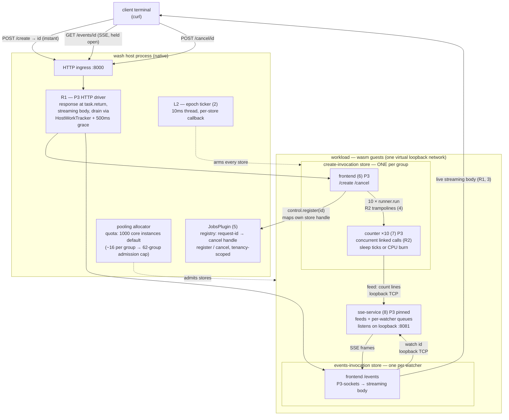
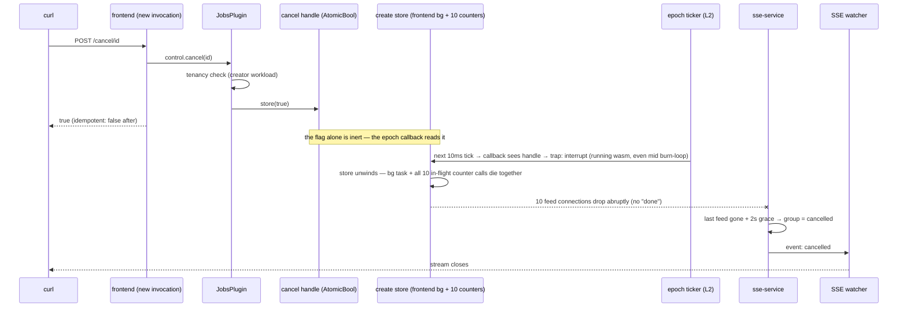

# Cancellation & P3 platform work — piece inventory

A component-by-component inventory of everything added on branch
`poc/implement-cancel-host-plugin` (as of 2026-06-12): each piece's
single role and its known limitations. For the design history and the
reasoning behind each decision, see [WORKLOAD_CANCELLATION.md](WORKLOAD_CANCELLATION.md);
for the measured load numbers and how to run the demo, see
[examples/cancellable-jobs/README.md](../../../examples/cancellable-jobs/README.md).

## Runtime platform pieces (`crates/wash-runtime`)

### 1. The cancel handle (the shared identity)

Every invocation's store gets an `Arc<AtomicBool>` (`Ctx.cancel_handle`,
minted in `new_store_from_metadata`) cloned into the active context and
every linked context, so one flag governs the whole linked graph.
Detectors (the plugin) set it; the epoch-deadline callback (Layer 2)
reads it. By itself the flag is inert — it's the shared identity the
actuator acts on, not an actuator.

*Originally* this branch also carried a **Layer 1 host-boundary gate**:
host functions called `ensure_not_cancelled()` on entry and returned a
trap if tripped. It was **removed** — epoch interruption (Layer 2)
strictly dominates it for stopping a runaway guest (it also catches the
pure-CPU case the gate never could), and the gate was only ever wired
into two keyvalue functions, so it never delivered the one property it
could have justified: *suppressing further host side effects after
cancel across the whole host surface*. If that safety property is later
required, the right shape is a single check in the host-call dispatch
path, not a per-function call — see the note in
[WORKLOAD_CANCELLATION.md](WORKLOAD_CANCELLATION.md).

### 2. Layer 2 — epoch interruption (the sole actuator)

On by default in `EngineBuilder`; a 10ms ticker thread bumps the engine
epoch, and each store's callback reads its own cancel handle →
`Interrupt` or `Continue`. A burning counter traps within ~10ms of
cancel, mid-loop, no cooperation needed. Since the host-boundary gate
was dropped (piece 1), this is the only thing that reads the handle to
stop the guest — and it covers every case the gate did plus pure CPU.

*Limitations:* it's a codegen flag, so precompiled `.cwasm` artifacts
must be built with the same setting (wash-precompile is synced; stale
artifacts fail loudly, not silently). It only interrupts *running
wasm* — a guest parked inside a host call is untouchable until that
call returns. Granularity is the store, which is fine here because
store = invocation.

### 3. R1 — P3 HTTP async-submit + streaming (`host/http_p3.rs` rewrite)

The response leaves the moment the guest calls `task.return`; the body
streams live (no buffering); a detached driver keeps the store alive
until the client has the whole body *and* background work has drained.
Client disconnect is detected by the body adapter's Drop.

*Limitations:* the drain is a heuristic — `HostWorkTracker` RAII guards
plus a 500ms grace window, because wasmtime 44 has no quiescence API
(the real one exists only in the dev tree). There's no per-call timeout
on this path. And every open SSE connection holds a live store — that's
the admission cost the pool quota later prices at ~16 core instances
per group.

### 4. R2 — concurrent linked-call trampolines (`engine/workload.rs`)

When a callee's export is async-lifted, component imports are wired
with `func_new_concurrent` → `call_concurrent`, so ten sibling calls
interleave inside one store (previously: instant trap "cannot block a
synchronous task"). Requires the `linked_instances` map filled eagerly
by `instantiate_linked`, because concurrent host functions can't
instantiate on demand in wasmtime 44.

*Limitations:* per-component ctx isolation during *overlapping calls to
different callees* is best-effort (logged warning; a principled fix
needs wasmtime to expose caller identity). Streams/futures still can't
cross component-to-component links. Eager instantiation of all linked
components per store is what multiplies pool cost. And one store = one
thread: ten concurrent counters are interleaved, not parallel.

### Fixes landed en route

- Engine builds need the **cranelift** feature: winch-only engines
  silently resolved to a compiler that rejects component-model async.
- **Self-import linking bug**: a component importing *and* exporting
  the same interface was linked to itself.

## The plugin (`crates/wash/src/jobs_plugin.rs`)

### 5. JobsPlugin — the cross-invocation cancel registry

Reduced to the single thing a guest cannot do: `register` maps the
*calling invocation's own* handle under a request-id; `cancel` trips
it, tenancy-checked against the creator's workload. No spawning, no
data path.

*Limitations:* the registry is never pruned — completed/cancelled ids
linger until host restart (RAII removal is a documented follow-up).
Tenancy is workload-scoped only; real multi-tenant authorization was
deliberately deferred. In-memory: a host restart forgets everything.

## Demo pieces (`examples/cancellable-jobs`)

### 6. Frontend (P3)

`/create` registers its own handle, spawns ten concurrent `runner.run`
WIT calls, returns the id instantly; `/events` is a byte pipe from the
service to a streaming response body; `/cancel` calls the plugin.

*Limitations:* the `/create` store stays alive while counters run, and
cancel is group-granular — one handle kills all ten (that's also the
feature).

### 7. Counter (P3)

Async `runner.run` export; reports over loopback TCP; sleep mode ticks
per second, burn mode is pure CPU.

*Limitations:* the burn loop must `yield_async` every ~100M iterations
or it starves its siblings and even the response delivery
(single-threaded store, wasmtime #11869). Cancellation does *not*
depend on those yields — only liveness of the uncancelled case does.

### 8. SSE service (P3)

The one long-lived piece (components stay short-lived; long-lived
connections belong in services). Owns feeds and watchers on virtual
loopback 8081; buffered line reads; per-watcher unbounded queues so a
slow client never backpressures the counters; 2s grace before declaring
a group done/cancelled. Originally WASI 0.2 (wstd) — rewritten as P3
after the 13-group scheduling wall was root-caused to the 0.2 poll ABI.

*Limitations:* unbounded queues mean a slow client costs memory; no
replay (you see counts from attach time); the 2s grace is a heuristic
for staggered feed startup; one instance per workload — sharding isn't
possible in this model.

### 9. builder + build.sh

Componentizes wasip1 core modules with the preview1 reactor adapter,
because the wasm32-wasip2 toolchain can't link component-model-async
guests yet.

*Limitation:* pure toolchain workaround; dies the day a
`wasm32-wasip3` Rust target ships.

### 10. loadtest.sh

N groups + N SSE watchers, per-connection event rates, self-cancelling
teardown.

*Limitations:* sequential creates (creation latency smears at high N),
and only sleep mode produces meaningful event counts.

## The measured ceilings, stacked

| ceiling | cause | character |
|---|---|---|
| 13 groups (gone) | WASI 0.2 poll ABI, O(N²) on one fiber | silent collapse — the bad kind |
| 62 groups | pooling allocator's default 1000 core-instance quota | loud admission errors, healthy groups unaffected, env-tunable (`WASMTIME_POOLING_TOTAL_*`) |
| ~220 groups | box CPU saturation | gradual, observable |

The arc of the branch in one sentence: every *silent* failure mode
encountered (spawn_blocking un-cancellability, the task.return wedge,
the 13-group cliff) got replaced by something either working or
*loudly* bounded — which is what production limits should look like.

## Diagrams

### The pieces and the data flow

### The cancellation chain (epoch interruption acting on one handle)

Reading it: the *only* shared state between "cancel arrives" and
"everything stops" is that one `AtomicBool` per group — the plugin
writes it, and the epoch callback reads it on the next 10ms tick,
trapping the running wasm even mid burn-loop. Everything downstream
(counters dying, feeds dropping, watchers getting `event: cancelled`)
is consequence, not coordination: the service *infers* cancellation
from the abrupt closes rather than being told.
